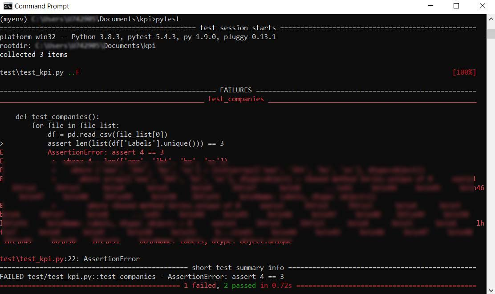

<h2>Python AdHoc Pivot Table</h2>
<h3>Main Script</h3>
<ul>
  <li>Script utilizes Pandas library to operate on the datasets.</li>
  <li>Data input: csv files.</li>
  <li>Script groups the data by the company name (3 of them) and sums up the count of records occurance.</li>
  <li>Script helps out either with ad-hoc queries or with monthly based KPI report.</li>
  <li>Time of script's work lasts 3-4 sec. whereas preparing pivots manually with excel lasts about 5 min (depending on user)</li>
  <li>The need of preparing these figures even couple of times a day saves a lot of time in terms of weeks or months.</li>
  <li>This is a good example of saving time with automated data processing.</li>
  <li>Implementing automation in data processing brings also data quality and eliminates risk of human's erros or oversights.</li>
</ul>

<h3>Pytest</h3>
<ul>
  <li>After an initial manual testing, I tend to write the autmoated test (trying to reach test-driven development standard).</li>
  <li>Automated test is the code that tries the main script's units of the code out - in a nutshell its a code for a code that already exists.</li>
  <li>In above example, the testing code checks:
    <ul>
      <li>If all of the input files are being stored in the main location (current directory for a script).</li>
      <li>If format of the input files is CSV.</li>
      <li>If number of columns in input files is correct.</li>
      <li>If values being stroed in the specifc columns are correct and valid for the analysis.</li>
      <li>If script's function returns expected object.</li>
    </ul>
  </li>
  <li>Like shown above, automated test gives us immediate feedback that everything went properly and we can be sure the final analysis will be perfored successfully with reliable figures.</li>
  <li>With automated tests I can predict potential scenarios when things may go wrong. When it happens library pytest indicates which element gets failed.</li>
  <li>Once again, due to the fact the test is automated we have additional time save as opposed to doing time-consuming manual checks.</li>
</ul>
<h3>Test Successful</h3>

<ul>
  <li>Test performed 3 checks regarding: input files, count of columns and values for the analysis.</li>
  <li>All 3 checks were performed successfully.</li>
</ul>
<h3>Test Failed</h3>

<ul>
  <li>When some of the checks failes, pytest indicates place in the code where failure appears.</li>
  <li>In the example above Test caputres one unexpected value in the Labels column which serves to group data by companies.</li>
</ul>
